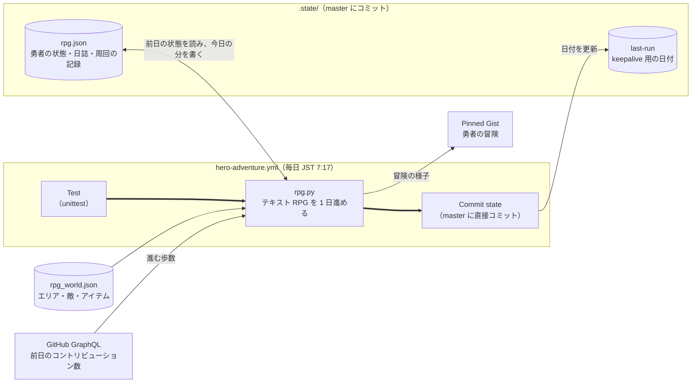
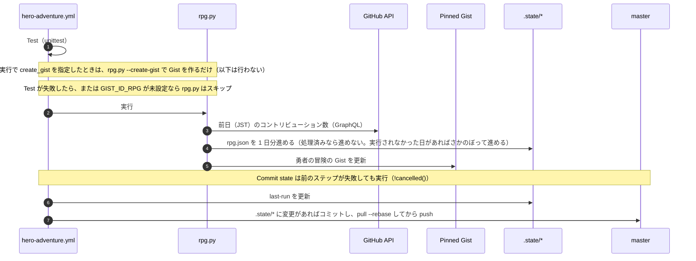

# データの流れ

どの workflow（とスクリプト）が、どのファイルを読み書きし、それが何に使われるかをまとめます。

## 全体図

- 太線（`hero-adventure.yml` の中）: ステップの実行順。各ステップの実行条件は下の「毎日の workflow の処理順」を参照
- 実線: データの読み書き

## ファイルごとの役割

| ファイル | 書き込み元 | 中身 | 使い道 |
|---|---|---|---|
| `rpg_world.json` | 人（手で編集） | テキスト RPG の世界（エリア・敵・ボス・店・イベントの起こりやすさ・歩数の決まり） | `rpg.py` の入力 |
| `.state/rpg.json` | `rpg.py` | 勇者の状態（位置・HP・レベル・装備など）、直近 30 日の日誌、周回の記録 | 翌日の続きと、Gist の表示 |
| `.state/last-run` | Commit state ステップ | 最終実行日（JST） | 60 日無活動で scheduled workflow が止まるのを防ぐ（keepalive） |

`.state/` の各ファイルの JSON 構成・項目の意味・例は [STATE_FORMAT.md](STATE_FORMAT.md) を参照してください。

保持期間:
- `rpg.json` は毎日上書きします（日誌は直近 30 日分、周回の記録は無制限）。
- `last-run` は毎回上書きします。

## 毎日の workflow の処理順

